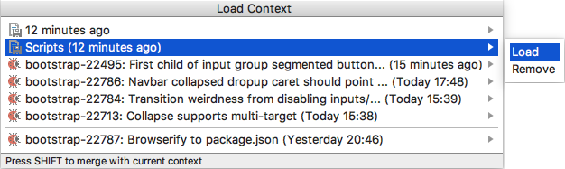

# Loading Contexts 

By loading a context, you open the saved set of files in the editor. You can load the contexts of the currently open [tasks](Tasks.md) as well as the contexts that you previously [saved](Contexts-saving.md).

#### To load a context
- Choose **Tools | Tasks & Contexts | Load Context** on the main menu. In the **Load Context** window that opens, either select the desired context or choose **Load** on the submenu:

    

    In the contexts list, manually saved contexts are represented by the  icon.

    > Press and hold the `Shift` key while selecting a context to merge it with your current context. The files from the merged context will be opened in conjunction with the currently open files.

---
🔙 [Contexts](Contexts.md)
