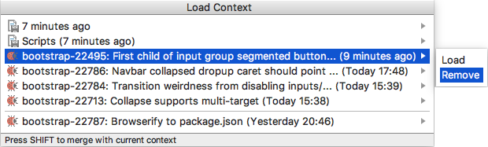

# Removing Contexts
If a context is not needed, you can remove it from the contexts list.

> Removing the context of a local task will [remove the task](Tasks-removing.md) and the associated [changelist][1] ![][ext].

#### To remove a context

1. Choose **Tools | Tasks & Contexts | Load Context** on the main menu.

2. In the **Load Context** window that opens, either click the right-arrow button or press the right arrow key next to the context you want to remove and choose **Remove** on the submenu.

    

---
🔙 [Contexts](Contexts.md)

[1]: https://www.jetbrains.com/help/idea/changelist.html

[ext]: ../img/ext-link.png
