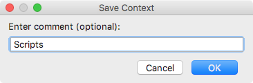

# Saving Contexts

When you save a context, the set of files currently open in the editor is saved as a named item, which allows you to [load](Contexts-loading.md) it later.  

#### To save the current context
- Choose **Tools | Tasks & Contexts | Save Context** on the main menu. In the **Save Context** dialog box that opens, provide the name of the context.

    

    > Providing the context's name is optional. If you choose to omit it, the current timestamp will be used as the name.

    Click **OK** to save the context. You can now load it when necessary.

---
🔙 [Contexts](Contexts.md)  
