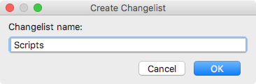

# Adding Changelists for the Tasks 

Associating a [changelist][1] ![][ext] with the task allows you to [commit][2] ![][ext] your changes to a VCS when [closing a task](Tasks-closing.md). Commonly, association is performed at the point of [creating a task](Tasks-opening.md).

If no changelist is currently associated with the task or you want to use a different changelist, you can create a changelist for the task.

#### To create or add a changelist for the task

1. Do one of the following:

    - If a changelist is associated with the task, choose **Tools | Tasks & Contexts | Add changelist for 'task ID'** on the main menu.
    - If no changelist is associated with the task, choose **Tools | Tasks & Contexts | Create changelist for 'task ID'** on the main menu.

2. In the **Create Changelist** dialog box that opens, provide the name of the changelist.

    

    Click **OK** to apply your changes.

The changelist will be created and [made active][3] ![][ext] to hold your changed files.

> If the task already had an associated changelist, the newly created changelist will not replace it. If needed, you can explicitly associate the newly created changelist with the task by [editing](Tasks-editing.md) the task.

---
🔙 [Tasks](Tasks.md)

[1]: https://www.jetbrains.com/help/idea/changelist.html
[2]: https://www.jetbrains.com/help/idea/committing-changes-to-a-local-git-repository.html
[3]: https://www.jetbrains.com/help/idea/assigning-an-active-changelist.html

[ext]: ../img/ext-link.png
