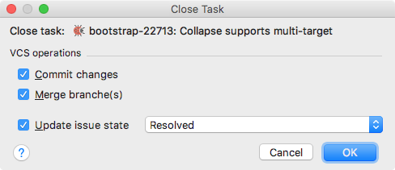

# Closing Tasks 

When you've finished working on a task, you can close it. 

####  To close a task
- Press `⌥⇧W` or choose **Tools** | **Tasks&Contexts** | **Close Task** on the main menu. In the **Close Task** dialog box that opens, select whether you want to [commit][1] ![][ext] your changes to the VCS, [merge][2] ![][ext] the current branch into the branch it was originally created from and update the issue state in the issue tracker.

    

    If you choose to commit your changes, the [changelist][3] ![][ext] associated with the task will become inactive after the task is closed. IntelliJ IDEA will prompt you to remove this changelist. 
    
    > Set up automatic handling of inactive changelists in the [Confirmation][4] ![][ext] settings page.

    Click **OK** to close the task.

> Set up an [issue navigation pattern][5] ![][ext] to be able to quickly navigate from the commit message in the [Version Control Tool Window][6] ![][ext] to the corresponding issue in the browser.

After the task is closed, it will still be available for selection when [opening](Tasks-opening.md) and [switching](Tasks-switching.md) tasks. If the task is not needed, you can [remove](Tasks-removing.md) it from the tasks list.

---
🔙 [Tasks](Tasks.md)

[1]: https://www.jetbrains.com/help/idea/committing-changes-to-a-local-git-repository.html
[2]: https://www.jetbrains.com/help/idea/merging-deleting-and-comparing-branches.html
[3]: https://www.jetbrains.com/help/idea/2017.1/changelist.html
[4]: https://www.jetbrains.com/help/idea/confirmation.html
[5]: https://www.jetbrains.com/help/idea/2017.1/handling-issues.html
[6]: https://www.jetbrains.com/help/idea/version-control-tool-window.html

[ext]: ../img/ext-link.png
