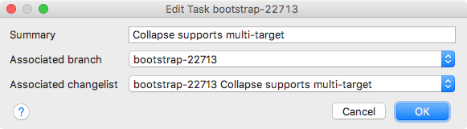
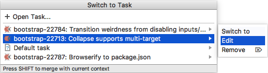

#  Editing Tasks 

If necessary, you can edit the details of an open task by providing a new summary for it, associating it with another [VCS branch][1] ![][ext] or another [changelist][2] ![][ext].

####  To edit the current task

1. Choose **Tools | Tasks & Contexts | Edit 'task ID'** on the main menu. 
2. In the **Edit Task 'task ID'** dialog box that opens, edit the parameters of the task and click **OK** to apply your changes.

    

    
####  To edit another open task 
1. Do any of the following:
    - Press `⌥⇧T`.
    - Choose **Tools | Tasks & Contexts | Switch Task** on the main menu.
    - Click the tasks drop-down list on the main toolbar.

2. In the tasks list or the **Switch to Task** window, either click the right-arrow button or press the right arrow key next to the task you want to edit and choose **Edit** on the submenu.

    

3. In the **Edit Task 'task ID'** dialog box that opens, edit the parameters of the task and click **OK** to apply your changes.

    

---
🔙 [Tasks](Tasks.md)

[1]: https://www.jetbrains.com/help/idea/managing-branches.html
[2]: https://www.jetbrains.com/help/idea/changelist.html

[ext]: ../img/ext-link.png
