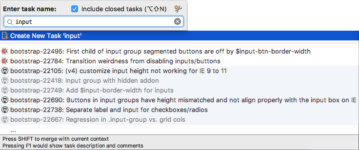
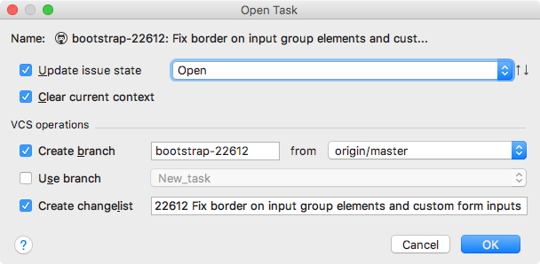

# Opening and Creating Tasks 

In IntelliJ IDEA terms, issues on a tracker that are not opened yet are called **tracker** tasks. 

Once you open a **tracker** task in IDEA, a **local** task is automatically created, and named in correlation with the original issue on the tracker. A local task also gets associated with a [context](Contexts.md), a [VCS branch][1] ![][ext] and a [changelist][2] ![][ext].

You can create local tasks by yourself, without associating them with tracker issues. Such tasks can define any arbitrary activity performed in IDEA.

#### To open a tracker task or create a local task

1. Do one of the following: 
    - Press `⌥⇧N`
    - On the main menu, choose **Tools** | **Tasks & Contexts** | **Open Task**.
    - Choose **Open** in the tasks drop-down list on the main toolbar.

        > By default, the tasks drop-down list is displayed only when you have at least one tracker task or a local task open. You can set it to be displayed at all times by selecting the corresponding option in the [tasks-related preferences][3] ![][ext].

2. In the [Open Task suggestion list][4] ![][ext] that opens, type the name of the task to start searching with the typed value. To include the already closed tasks in the search scope, select the **Include closed tasks** check box by pressing `⌥⇧N` once more. A closed task is one of the following:

    - A tracker task with the **closed** status in the issue tracker. 
    
    - A local task not associated with a changelist. (Applicable in case a version control system is assigned to the [entire project][5] ![][ext] or the [affected directory][6] ![][ext].)

    

    In the suggestion list, tracker tasks are displayed with the light-blue background color. Opened tasks and self-defined local tasks are displayed with the white background color. Closed tasks appear greyed out.

    > Select the ellipsis `...` item at the bottom of the suggestion list to download more issues from the issue tracker that match the provided search query.

3. Do any of the following:
    - To open a tracker task or an existing local task, choose it from the list.

        > Press `F1` to instantly open the currently highlighted task's description in a pop-up window.
 
    - To create a self-defined local task with the specified description, choose **Create New Task**.    
 
4. In the [Open Task dialog box][7] ![][ext] that opens, specify whether you want IntelliJ IDEA to [clear the current context](Contexts-clearing.md), create a new changelist for the task, change the corresponding issue's state in the tracking system, create a new VCS branch or use the existing one. 

    

    Click **OK** to apply your changes. The task will be created and IntelliJ IDEA will switch to it automatically.

---
🔙 [Tasks](Tasks.md)

[1]: https://www.jetbrains.com/help/idea/managing-branches.html
[2]: https://www.jetbrains.com/help/idea/changelist.html
[3]: https://www.jetbrains.com/help/idea/tasks.html
[4]: https://www.jetbrains.com/help/idea/open-task-dialog.html#suggestion_list
[5]: https://www.jetbrains.com/help/idea/2017.1/associating-a-project-root-with-a-version-control-system.html
[6]: https://www.jetbrains.com/help/idea/associating-a-directory-with-a-specific-version-control-system.html
[7]: https://www.jetbrains.com/help/idea/open-task-dialog.html

[ext]: ../img/ext-link.png
