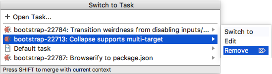

# Removing Tasks 
If a local task is not needed, you can remove it from the tasks list. Unlike [closing a task](Tasks-closing.md), removing a task will not affect the state of the issue in the issue tracker.

#### To remove a task 

1. Do any of the following:

    - Press `⌥⇧T`.
    - Choose **Tools | Tasks & Contexts | Switch Task** on the main menu.
    - Click the tasks drop-down list on the main toolbar.

2. In the tasks list or the **Switch to Task** window that opens, select one or several tasks you want to remove.  

    > To select multiple items, use the `Shift` (for adjacent items) or the `Cmd` (for non-adjacent items) keys. 

3. Click the right-arrow button or press the right arrow key and choose **Remove** on the submenu:  

    

    The task and the associated [changelist][1] ![][ext] will be removed. If the changelist is not empty, IntelliJ IDEA will prompt you to move your changes to another changelist.

---
🔙 [Tasks](Tasks.md)

[1]: https://www.jetbrains.com/help/idea/changelist.html

[ext]: ../img/ext-link.png
