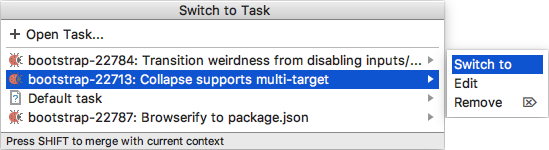

#  Switching Between Tasks
If you have several tasks open, you can quickly switch between them. When you switch to another task, IntelliJ IDEA switches to the task's [context](Contexts.md), loads the associated [changelist][1] ![][ext] and the attached [stack trace][2] ![][ext], if any.

#### To switch between tasks
Do any of the following:

- Click the tasks drop-down list in the main toolbar and either select the desired task from the list or choose **Switch to** on the submenu.

- Press `⌥⇧T` or choose **Tools | Tasks & Contexts | Switch Task** on the main menu. In the **Switch to Task** window that opens, either select the desired task from the list or choose **Switch to** on the submenu.

    
    
    > Press and hold the `Shift` key while selecting a task to merge its context with the current one. The files from the selected task's context will be opened in conjunction with your currently open files.

> If you need to [open a task](Tasks-opening.md), choose the **Open Task** option.

---
🔙 [Tasks](Tasks.md)

[1]: https://www.jetbrains.com/help/idea/changelist.html
[2]: https://www.jetbrains.com/help/idea/analyzing-external-stacktraces.html

[ext]: ../img/ext-link.png
